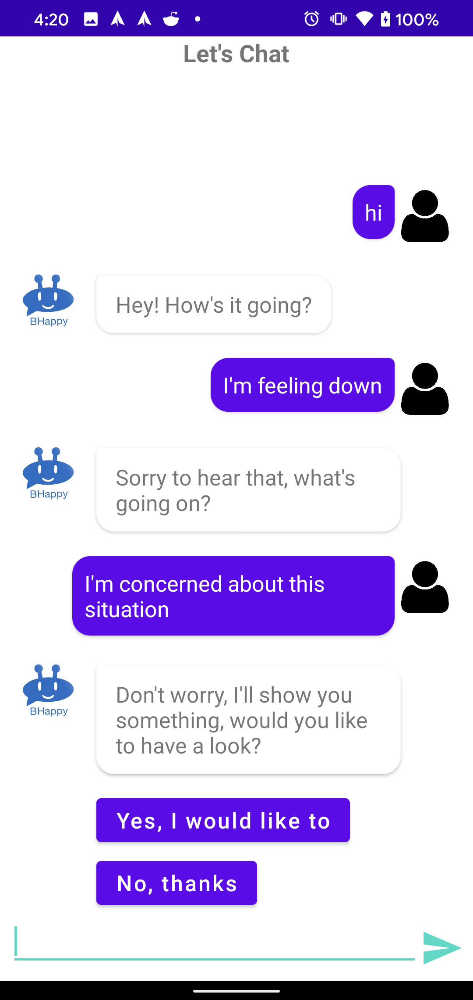

## BHappy

BHappy is an interactive Chatbot powered by Artificial intelligence to provide comfort and support for individuals through their challenging times. 
Bhappy aims to help individuals by being available, provide support, and entertainment ranging from interactive games, 
organize calendar meetup with friends/family, or seek assistance (eg. A virtual personal trainer for losing weight or seeking a professional therapist for serious issue) 
By being available at all times, Bhappy will be a companion that you wouldn’t want to let go!

BHappy is the result from #flattenthecurvehack hackathon, organized by Australian Computer Society from 6pm 09/04/2020 to 9pm 11/04/2020.

One of the challenge during this global pandemic is:

    Mental Health and wellbeing 

    1. Promoting connection to family and friends to mitigate mental effects of social isolation.
    2. Mass scale mental health identification and tools to address through more convenient and accessible means.

This app is the optimal solution for this problem and has the potention to expand in the future.

## How the app work

This Android application is the frontend which communicate with a chatbot ([DialogFlow from Google](https://dialogflow.com)), this bot is a friendly company and it try to identify the problem that user have and suggest the optimal solution using Artificial Intelligent.

